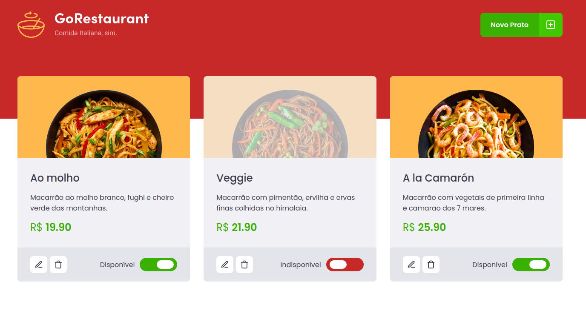

  

# GoRestaurant 🍝
Este repositório é referente ao desafio 'CRUD React' do Bootcamp GoStack 11.0, da Rocketseat 🚀.

<h2>Objetivo</h2>

Conseguir criar pratos para um cardápio, exibir o prato, conferir disponibilidade, preço e descrição

Possibilitar a edição do prato e exclusão do mesmo.

# Resultado 🚀

  

# Techs
React ⚛️  
React Modal ⚛️  
Styled-Components 💅🏻  
Jest 🃏  
React Icons ⚛️❤️  
Typescript 🦕
